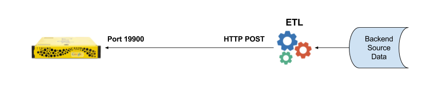
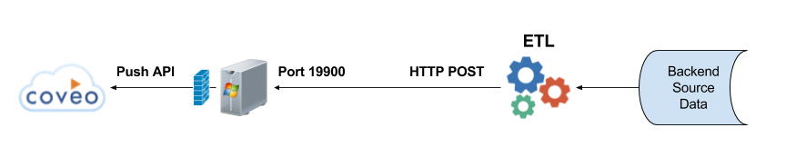

# Synopsis
A common practice for GSA administrators is to develop a custom process to extract, transform and feed records from non-conventional sources to the GSA feedergate listener on port 19900. The feed will be of type full (replace all content from this source), incremental (update content from this source) or metadata-and-url (treated as incremental). The metadata-and-url feed is often used to augment meatdata that is missing from the target web page.

The intent of this project is to provide a mechanism to integrate custom GSA feeds to the Coveo cloud push API. The intent IS NOT to replace GSA 4.x connectors, that also use the GSA feed mechanism, as these will be handled by native Coveo connectors as appropriate.



The above diagram is a typical scenario of how a GSA admin will create custom extracts from a backend source, write a transformation script to generate the GSA XML feed, and then POST this to the GSA xmlfeed endpoint on port 19900 (port 19902 for HTTPS). The Coveo Push Listener is intended to sit in place of the GSA and convert the posted XML feed to a push payload for the Coveo Push API.




The GSA Feed to Coveo Push Listener will be run on an on-premise windows server that has outbound connectivity to the Coveo push API endpoints. It's important to note that this has been designed to run multiple instances using different listening ports, allowing for better non-blocking throughput from multiple ETL feeds.

## Dependencies

You need **DotNetZip** and **zlib.net** as dependencies. Extract them in their own folders under **./packages/** :

1. https://www.nuget.org/packages/DotNetZip/
1. https://www.nuget.org/packages/zlib.net/

## How to setup the Listener

The following steps are necessary to configure and run the Coveo Push Listener.

1. Setup a Windows Server to host the listener
1. Add a Push Source to Coveo
1. Download and unpack the gsa2coveo.zip file
1. Edit the ConnectorConfig.config file found in the gsa2coveo folder
    1. Complete the field values as appropriate
```json
  "PLATFORM_API_ENDPOINT": "https://platform.cloud.coveo.com",
  "PUSH_API_ENDPOINT": "https://push.cloud.coveo.com",
  "LISTENING_HOST": "<Hosting Server Name>",
  "LISTENING_PORT": "19900", // Note that this can be any available port. Typically use 1990x
  "ORGANIZATION_ID": "<Coveo Organization ID>",
  "PUSH_SOURCE_ID": "<Coveo Push Source ID>",
  "PROVIDER_ID": "<Provider Name>",
  "API_KEY": "<API Key with sufficient organization and source privileges>",
  "TEMP_FOLDER": "c:\\temp\\coveo", // Be sure to use double backslash for the windows path
  "DELETE_ON_INVALID_URL": true, // Used in metadata-and-url feeds that do not return 200/OK.
  "REQUIRE_DISPLAY_URL": false, // This can be ignored. DisplayUrl with be set to Url if missing.
  "PUSH_RECORDS_WITHOUT_ACL": true // This allows you to push documents without permissions(Allow everyone).
```
1. Open the listening port on the windows server
    1. Navigate to Control Panel, System and Security and Windows Firewall.
    1. Select Advanced settings and highlight Inbound Rules in the left pane.
    1. Right click Inbound Rules and select New Rule.
    1. Add the port you need to open and click Next.
    1. Add the protocol (TCP or UDP) and the port number into the next window and click Next.
    1. Select Allow the connection in the next window and hit Next.
    1. Select the network type as you see fit and click Next.
    1. Name the rule something meaningful and click Finish.
1. Open Windows PowerShell and execute the "GSAFeedPushConverter.exe" file
    1. This listens for POST requests on the configured port.
    1. XML payloads will be queued (non-blocking for subsequent posts)
    1. Each record will be formated and pushed to Coveo
    1. Recommend using NSSM to set up a service to restart the service if necessary
1. ETL process can now POST to the configured host and port endponts
    1. `http://<LISTENING_HOST>:<LISTENING_PORT>/xmlfeed/`
    1. `http://<LISTENING_HOST>:<LISTENING_PORT>/xmlgroups/`
1. Optionally, the endpoints support optional query parameters to redirect the push
    1. Allows multiple ETL processes to use the same listener
    1. `http://<LISTENING_HOST>:<LISTENING_PORT>/xmlfeed/?sourceid=<SourceId>&orgid=<OrgId>&apikey=<ApiKey>&providerid=<ProviderId>`
    1. Typically only the "sourceid" may be needed if multiple ETL processes are using the same listener to push to different sources

## Samples

### Content Feed

In this example, a "content" feed is being pushed incrementally. The record "url" will be pushed as the Coveo "uri" and "clickableuri" is set to the "displayurl" attribute value. The meta tags will be pushed as fields and the "content" will be added as the push "body". Note that this tool supports attachments, allowing the ETL admin to map a network drive to attached file repository and then use this as the path in the feed record. This tool will push each attachment as a child item of the parent record to support folding in the results.
```xml
<?xml version="1.0" encoding="UTF-8"?><!DOCTYPE gsafeed PUBLIC "-//Google//DTD GSA Feeds//EN" "">
<gsafeed>
   <header>
      <datasource>darts_content_feed</datasource>
      <feedtype>incremental</feedtype>
   </header>
   <group>
   <record url="https://my.company.com/kb/showPC.cfm?id=kcs000320" displayurl="https://my.company.com/kb/showPC.cfm?id=kcs000320" action="add" mimetype="text/html" crawl-once="true">
      <metadata>
         <meta name="Category1" content="Tools &amp; Utilities"/>
         <meta name="Category2" content="Connectors"/>
         <meta name="id" content="KCS003209"/>
         <meta name="abstract" content=".Net 15.00 not working against Widget 15.10"/>
      </metadata>
      <attachments>
         <path content="\\\\<shared_drive\\files\\KCS000320"/>
      </attachments>
      <content><![CDATA[<div dir="ltr"><span style="font-size:10pt;font-family:arial;">Customer Upgraded database from 15.00 to 15.10.02.09.</span></div>
         <div dir="ltr"><span style="font-size:10pt;font-family:arial;">&nbsp;</span></div>
         <div dir="ltr"><span style="font-size:10pt;font-family:arial;">After that one of their Windows application servers using .Net 15.00 stopped working.</span></div>]]>
      </content>
   </record>
   </group>
</gsafeed>
```

### Metadata-and-url Feed
In this example, each record simply provides a URL to a web page along with additional metadata to be added to the document. This is the most common scenario for GSA feeds. The listener creates a Coveo document to push with the URL and metadata, however it downloads the web page and includes this as the body of the item before pushing.
```xml
<?xml version="1.0" encoding="utf-8"?>
<!DOCTYPE gsafeed PUBLIC "-//Google//DTD GSA Feeds//EN" "">
<gsafeed>
   <header>
      <datasource>TeradataUniversity</datasource>
      <feedtype>metadata-and-url</feedtype>
   </header>
   <group>
      <record url="http://my.company.com/plateau/user/deeplink.do?linkId=ITEM_DETAILS&amp;componentID=43842&amp;componentTypeID=RECORDED-WEBCAST&amp;revisionDate=1244507220000" mimetype="text/plain">
         <metadata>
            <meta name="type=" content="Engineering"></meta>
            <meta name="category" content="Webcast">
         </metadata>
      </record>
      <record url="http://my.company.com/plateau/user/deeplink.do?linkId=ITEM_DETAILS&amp;componentID=53872&amp;componentTypeID=VIDEO&amp;revisionDate=1244507220000" mimetype="text/plain">
         <metadata>
            <meta name="type=" content="Administration"></meta>
            <meta name="category" content="Video">
         </metadata>
      </record>
   </group>
</gsafeed>
```
